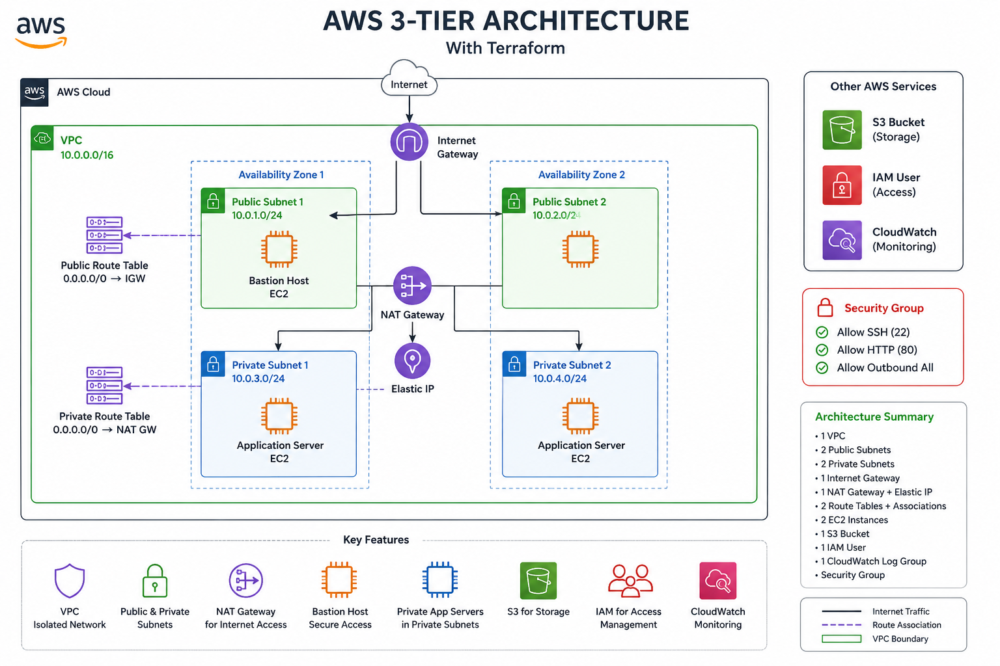

<<<<<<< HEAD
# Terraform AWS 3-Tier Architecture

## Project Overview

This project provisions a production-style AWS 3-tier infrastructure using Terraform modules.

The infrastructure includes:
- VPC
- Public & Private Subnets
- NAT Gateway
- Internet Gateway
- Route Tables
- EC2 Instances
- Security Groups
- IAM User
- S3 Bucket
- CloudWatch

---

## Architecture Diagram



---

## AWS Services Used

| Service | Purpose |
|---|---|
| VPC | Network Isolation |
| EC2 | Compute |
| S3 | Storage |
| IAM | Access Management |
| CloudWatch | Monitoring |
| NAT Gateway | Internet access for private subnet |

---

## Project Structure

```bash
modules/
├── networking
├── compute
├── security
├── storage
```

---

## Terraform Commands

### Initialize

```bash
terraform init
```

### Validate

```bash
terraform validate
```

### Plan

```bash
terraform plan
```

### Apply

```bash
terraform apply
```

### Destroy

```bash
terraform destroy
```

---

## Features

- Modular Terraform Architecture
- Reusable Infrastructure Modules
- Infrastructure as Code (IaC)
- Production-style AWS Networking
- Secure Infrastructure Design

---

## Learning Outcomes

- AWS Networking
- Terraform Modules
- Infrastructure Automation
- Cloud Security Basics
- GitHub Version Control
- DevOps Practices

---

## Author

Aditya Yadav
